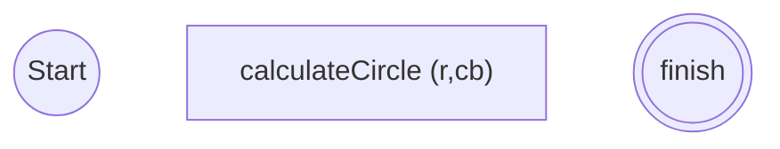

# Penjelasan Minitask(2)

[here is file](./minitask3.js)

Cara kerja dari object tersebut:

- ketika membuat function di dalam object, perlu menggunakan `this` keyword untuk memanggil property di dalam scope object tersebut.
- contoh pada log yg menampilkan `ringkasan()`:
  - akan memanggil method ringkasan dari circle
  - `ringkasan()` akan memanggil property `luas()` dan `keliling()` yang berada dalam object circle.
  - `luas()` akan memanggil nilai PI dari property value milik PI didalam circle. begitu jg dg property r.
  - method keliling jg punya konsep yg sama seperti method luas

# Penjelasan Minitask(4)

[here is file](./minitask4.js)

## Alur Passing Function

contoh membuat function plus:

```js
function plus(a, b) {
  return a + b;
}
console.log(plus(2, 3));
```

- dengan memanggilnya di dalam console log `plus(2,3)`.
- argumen 2 dan 3 akan mengisi paramater dari function `plus sbg a dan b.
- kemudian a dan b di kalkulasi di dalam function plus

## Alur pemanggilan callback

contoh pada [minitask4](./minitask4.js)

calculateCirle sbg fungsi utama yang memanggil callback function

kemudian ada aksi" function lainnya seperti fungsi luas dan keliling.

ketika fungsi utama dipanggil dg `calculateCircle(4,luas)`

nilai 4 akan menjadi argumen `r` yang mana merupakan parameter fungsi utama. argumen `luas` akan menjadi function yang mengisi parameter dari fungsi utama.

dimana function `luas` tersebut dijalankan didalam fungsi utama.

function `luas` sendiri mengambil argumen `r` sbg parameter `numb` yang dia miliki, dan dijalankan di dalamnya.

## return

return akan mengembalikan nilai yang bisa digunakan kembali.

misal untuk print nilai dari luas atau keliling.

# Flowchart


