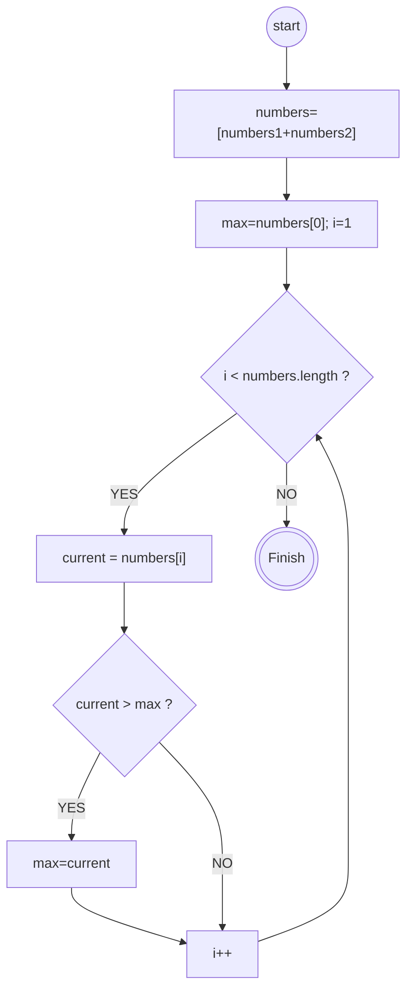
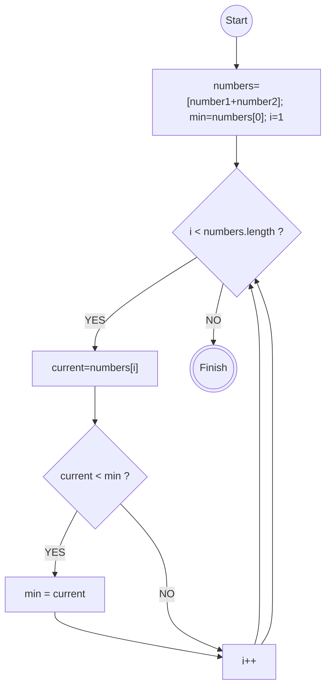
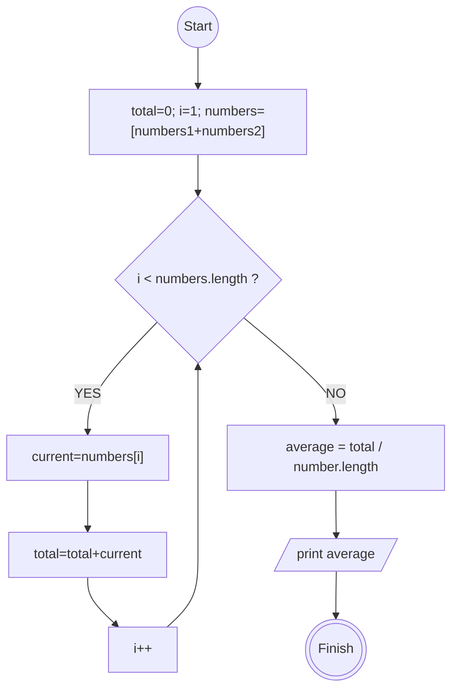

# Hitung nilai dg proses (Max, Min, Average)

# Flowchart MAX

```mermaid

flowchart TD
    start((start))
    array["numbers=[numbers1+numbers2]"]
    start-->array

    max["max=numbers[0]; i=1"]
    array-->max
    checkFor{"i < numbers.length ?"}
    max-->checkFor
    currentLoop["current = numbers[i]"]
    checkFor-- YES -->currentLoop
    checkFor-- NO -->finish
    finish(((Finish)))
    increment["i++"]


    checkMax{current > max ?}
    currentLoop-->checkMax


    checkMax-- YES -->currentMax
    currentMax["max=current"]
    currentMax-->increment
    increment-->checkFor

    checkMax-- NO -->increment

```

# Flowchart MIN

```mermaid

flowchart TD
    start((Start))


    min["numbers=[number1+number2]; min=numbers[0]; i=1"]

    start-->min


    checkFor{"i < numbers.length ?"}

    current["current=numbers[i]"]
    checkMin{"current < min ?"}

    increment-->checkFor
    min-->checkFor
    checkFor -- YES -->current


    current -->checkMin

    checkMin-- YES -->currentMin

    currentMin["min = current"]
    currentMin-->increment
    increment["i++"]

    finish(((Finish)))

    checkMin -- NO --> increment
    increment --> checkFor
    checkFor-- NO -->finish

```

# Flowchart AVERAGE

```mermaid

flowchart TD
    start((Start))


    declare["total=0; i=1; numbers=[numbers1+numbers2]"]

    start --> declare

    checkFor{"i < numbers.length ? "}
    declare --> checkFor

    checkFor-- YES -->current
    calculate["total=total+current"]

    current["current=numbers[i]"]
    current --> calculate

    increment["i++"]
    calculate -->increment

    increment-->checkFor
    checkFor -- NO -->average

    average["average = total / number.length"]

    print[/print average/]

    average-->print

    print-->finish

    finish(((Finish)))


```
